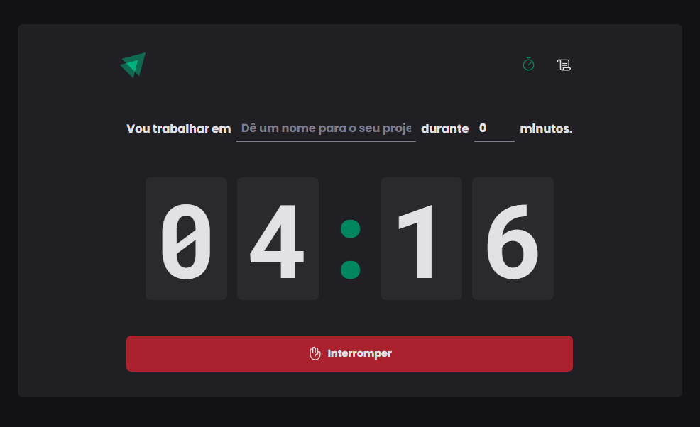

# Ignite Timer

[Live App](https://capelaum-ignite-timer.vercel.app/)

> Projeto desenvolvido no módulo 2 do programa Ignite - Trilha React 2.0.

## Descrição

Neste projeto foi possível praticar diversos elementos do React e seu ecossistema, incluindo React-Hook-Form, Context API, Reducers, UseEffect, Vite, React-Router-DOM, Styled Components, zod, entre outros.

## Layout

[Layout no Figma][figma]

## Tech

- [Vite][vite]
- [Styled Components][styled]
- [React Hook Form][react_hook_form]
- [React Router DOM][react_router_dom]
- [Zod][zod]
- [date-fns][date_fns]
- [immer][immer]
- [Phosphor Icons][phosphor]
- [React Github Corner][react-github-corner]

[vite]: https://vitejs.dev
[zod]: https://zod.dev
[date_fns]: https://date-fns.org
[immer]: https://www.npmjs.com/package/immer
[styled]: https://styled-components.com
[react_hook_form]: https://react-hook-form.com
[react_router_dom]: https://www.jsdocs.io/package/react-router-dom
[phosphor]: https://phosphoricons.com
[react-github-corner]: https://www.npmjs.com/package/react-github-corner
[figma]: https://www.figma.com/community/file/1127351821076435124
